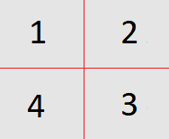

# Red Wine Quality Analysis

## Table of Contents
<ul>
<li><a href="#intro">Introduction</a></li>
<li><a href="#univariate-analysis">Univariate Analysis</a></li>
<li><a href="#bivariate-analysis">Bivariate Analysis</a></li>
<li><a href="#multivariate-analysis">Multivariate Analysis</a></li>
<li><a href="#summary">Final Plots and Summary</a></li>
<li><a href="#reflection">Reflection</a></li>
</ul>

<a id='intro'></a>

# Introduction
Apply exploratory data analysis techniques to explore relationships in one variable to multiple variables.

**Variables** (based on physicochemical tests):

<ol>
<li>fixed acidity (tartaric acid - g / dm^3)</li>
<li>volatile acidity (acetic acid - g / dm^3)</li>
<li>citric acid (g / dm^3)</li>
<li>residual sugar (g / dm^3)</li>
<li>chlorides (sodium chloride - g / dm^3</li>
<li>free sulfur dioxide (mg / dm^3)</li>
<li>total sulfur dioxide (mg / dm^3)</li>
<li>density (g / cm^3)</li>
<li>pH</li>
<li>sulphates (potassium sulphate - g / dm3)</li>
<li>alcohol (% by volume)</li>
<li>quality (score between 0 and 10)</li>
</ol>

**Question to answer**

Which chemical properties and how are they influence the quality of red wines?

-----

```{r echo=FALSE, message=FALSE, warning=FALSE, packages}

# Load all of the packages that you end up using in your analysis in this code
# chunk.

# Notice that the parameter "echo" was set to FALSE for this code chunk. This
# prevents the code from displaying in the knitted HTML output. You should set
# echo=FALSE for all code chunks in your file, unless it makes sense for your
# report to show the code that generated a particular plot.

# The other parameters for "message" and "warning" should also be set to FALSE
# for other code chunks once you have verified that each plot comes out as you
# want it to. This will clean up the flow of your report.
library(ggplot2)
library(gridExtra)
library(GGally)
library(psych)
library(RColorBrewer)
library(tidyr)
library(dplyr)
library(plyr)
```

```{r echo=FALSE, Load_the_Data}

# Load the Data
setwd('C:/Users/ayumi/Documents/git/udacity-data-analyst/05-red-wine-data-analysis/data/')

red_wine <- read.csv('wine-quality-reds.csv') 

```
<a id='univariate-analysis'></a>

# Univariate Plots Section

```{r echo=FALSE, Dataset_Dim}

# Displaying dimension of red wine dataset
dim(red_wine)

```

Red wine dataset has 1599 rows and 13 variables.<br/>

Check to see if there is any missing values.

```{r echo=FALSE, Dataset_NA}

# Check if there is any missing values.
sum(is.na(red_wine))

```

Displaying structure of red wine dataset to learn more about those 13 variables.<br/>

```{r echo=FALSE, Dataset_Str}

# Displaying structure of red wine dataset
str(red_wine)

```

Displaying first 5 rows of red wine dataset.

```{r echo=FALSE, Dataset_Head}

# Looking at first 5 rows of red wine dataset
head(red_wine, 5)

```

Displaying summary of red wine dataset.

```{r echo=FALSE, Dataset_Summary}

# Looking at summary of red wine dataset
summary(red_wine[, c(2:13)])

```

Although quality can be represented in integer, I would like to create new column for categorical data type. Converting quality column to factor. 

```{r echo=FALSE, Dataset_Quality_To_Factor}

# Create ordered factor data type for quality 
red_wine$quality.factor <- factor(red_wine$quality, 
  levels=c('1', '2', '3', '4', '5', '6', '7', '8', '9', '10'), ordered=TRUE)

# Display structure of newly created column
str(red_wine$quality.factor)

```

First, I will look at the distribution of quality.

```{r echo=FALSE, Univariate_Plots_Quality_Table}

# Display number of wines in each quality category
table(red_wine$quality.factor)

```

```{r echo=FALSE, Univariate_Plots_Quality}

# Plot distribution of quality
ggplot(red_wine, aes(x = quality)) + 
  geom_bar()

```

From the plot, majority of red wines in dataset fall into quality category 5 & 6. The lowest quality is 3, and the highest quality is 8. The mean is 5.636. The distribution is normal. Number of wines in quality category 3, 4, and 8 are very little compare to the ones in 5 and 6.<br/>

I want to explore which of wine features affect wine quality. <br/>

I will first look at features related to acids. 
- fixed acidity which impact the sourness or tartness in wine taste
- volatile acidity which indicates wine spoilage
- citric acid which adds freshness and flavors to wines

```{r echo=FALSE, Univariate_Plots_Fixed_Acidity}

# Plot distribution of fixed acidity
ggplot(red_wine, aes(x = fixed.acidity)) + 
  geom_histogram(binwidth = 0.4)

``` 

Majority of wine have fixed acidity between 6 and 11. The most popular value is somewhere around 7.5.  I see some wines have fixed acidity of 15 - 16. However, they don't seem to be extreme, so I will consider them valid data. The distribution looks normal.

```{r echo=FALSE, Univariate_Plots_Volatile_Acidity}

# Plot distribution of volatile acidity
ggplot(red_wine, aes(x = volatile.acidity)) + 
  geom_histogram(binwidth = 0.05)

```

Most of wines have volatile acidity in 0.2 ~ 0.8. There are few wines have very low (<= 0.1) or very high (>= 1.1) volatile acidity. Even though volatile acidity is associated with wine spoilage, there is no wine with volatile acidity 0.0. I see some wines have volatile acidity of 1.6. However, they don't seem to be extreme, so I will consider them valid data. The distribution looks bimodal. There is a dip around 0.45 ~ 0.6.


```{r echo=FALSE, Univariate_Plots_Citric_Acid}

# Plot distribution of Citric Acid
ggplot(red_wine, aes(x = citric.acid)) + 
  geom_histogram(binwidth = 0.05)

```

Majority of wines have citric acid between 0.00 to 0.50. There are very few wines have very high citric acid (> 0.75).  I see some wines have citric acid of 1. However, they don't seem to be extreme, so I will consider them valid data. <br/>

Other features I would like to look at is residual suger and alcohol since they both play roles in sweet taste in wine.

```{r echo=FALSE, Univariate_Plots_Residual_Suger_Multi}

# Plot distribution of residual sugar
p1 <- ggplot(red_wine, aes(x = residual.sugar)) + 
  geom_histogram(binwidth = 0.5)

# Plot distribution of log10 residual suger
p2 <- ggplot(red_wine, aes(x = residual.sugar)) + 
  geom_histogram(binwidth = 0.05) +
  scale_x_log10() + xlab("residual.suger (log10)")

grid.arrange(p1, p2, ncol = 2)

```

Transformed the long tail data to better understand the distribution of residual sugar. After log-transformed, the distribution looks normal.<br/>

Most of wine has residual sugar between 2 and 5. Some wines have twice or closed to three times more residual sugar than majority of wines.  The most popular residual sugar value is around 2.6 ~ 2.7. 

```{r echo=FALSE, Univariate_Plots_Alcohol}

# Plot distribution of alcohol
ggplot(red_wine, aes(x = alcohol)) + 
  geom_histogram(binwidth = 0.25)

```

Most of wines has alcohol percentage between 5 and 12. The most popular alcohol percentage is around 7.5. I see some wine has alcohol percentage 15, but I consider this data valid data. The distribution looks normal.

# Univariate Analysis

### What is the structure of your dataset?

There are 1599 red wines in dataset with 13 features.

1.  Wine ID (integer)
2.	Fixed acidity (numeric) - Acidity in wine
3.	Volatile acidity (numeric) - Wine Fault, Defect, Spoilage
4.	Citric acid (numeric) - Freshness and flavors of wine
5.	Residual sugar (numeric) - Amount of sugar in wine
6.	Chlorides (numeric) - Amount of salt in wine
7.	Free sulfur dioxide (numeric) - Anti-microbial and anti-oxidant
8.	Total sulfur dioxide (numeric) - Anti-microbial and anti-oxidant
9.	Density (numeric) - Wine density
10.	pH (numeric) - Measure of the acidity of wine, 0 (very acidic) to 14 (very basic); most wines are between 3-4 on the pH scale
11.	Sulphates (numeric) - Preservative, Anti-microbial and anti-oxidant
12.	Alcohol (numeric) - Percent alcohol content of wine
13.	Quality (integer) - Wine Quality (score between 0 and 10)
14.	Quality (factor) - Wine Quality (score between 0 and 10)

   
### What is/are the main feature(s) of interest in your dataset?

The main features in the dataset is quality and features impact sweetness and acidity of wine, i.e., fixed and volatile acidity, citric acid, residual sugar, and alcohol. I like to investigate which of those features have strong correlation to wine quality.

### What other features in the dataset do you think will help support your investigation into your feature(s) of interest?

I think Chlorides which indicates salt in wine, pH level which measures the acidity, and density which is affected by sugar and alcohol content will support my investigation. 

### Did you create any new variables from existing variables in the dataset?
I have created new column for quality factor data type.

### Of the features you investigated, were there any unusual distributions? Did you perform any operations on the data to tidy, adjust, or change the form of the data? If so, why did you do this?

I didn't see anything unusual. There were few outliers in some of variables, but they didn't seem extreme to indicate bad data. I also didn't see any missing values in the dataset, either.

I log-transformed long tail data to better understand the distribution of residual sugar.

<a id='bivariate-analysis'></a>

# Bivariate Plots Section

```{r echo=FALSE, Bivariate_Plots_Coefficient}

red_wine_subset <- red_wine[, c(2:6, 9, 10, 12, 13)]

cor_result = cor(red_wine_subset)
round(cor_result, 3)
```

Looking at the correlation coefficient between quality and other variables I am interested in from the univariate analysis, volatile acidity (-0.391) and alcohol (0.476) are moderately correlated with quality and citric acid is somewhat correlated with quality. <br/>

All other features I assumed to have effect on quality wine, i.e., Fixed acidity, residual sugar, chlorides, density, and pH level, have weak correlation with quality.

```{r echo=FALSE, Bivariate_Plots_Pairs_Panels}

# sample 500 red wines from the data set
set.seed(5432)
red_wine_sample <- red_wine_subset[
  sample.int(nrow(red_wine_subset), 500), ]

# Display scatter plot of matrices (SPLOM)
pairs.panels(red_wine_sample, scale = FALSE)

```

Other things I observed in the matrix above is I see some correlation between features related to each other.<br/>

Alcohol and residual sugar are moderately correlate with density. This make sense as density is determined by alcohol and sugar contents of wine.  pH moderately correlates with fixed acidity and citric acid as it measures acidity of wine. Lastly, fixed acidity and volatile acidity correlates with citric acid.  <br/>

I will explore 3 most correlated variables, volatile acidity, alcohol, and citric acid, with quality further and investigate how they affect wine quality. <br/>

Before I start exploring 3 most correlated variables, I am going to look at summary of quality once again.

```{r echo=FALSE, Bivariate_Plots_Quality_Summary}

# Display summary of quality
summary(red_wine$quality)

```

Mean is 5.636. Third quartile value is 6, and maximum value 8.  I will consider good quality wine as any wines categorized as quality 6. <br/>

I will first look at alcohol as it has strongest correlation with quality among given features.


```{r echo=FALSE, Bivariate_Plots_Multi_Plot}

# Define function to scatter plot and boxplot for given feature
Red_Wine_Bivariate_Plots <- function(dataset, feature) 
{
  
  # Scatter plot with linear smooths line
  p1 <- ggplot(aes_string(x = 'quality', y = feature), data = dataset) +
    geom_jitter(alpha = 1/3, position = position_jitter(h = 0)) +
    geom_smooth(method = 'lm', color = 'red')

  # Boxplot with alcohol mean line
  p2 <- ggplot(data = dataset, aes_string(x = 'quality.factor', y = feature)) +
    geom_boxplot() +
    geom_hline(
      yintercept = mean(dataset[, feature]), linetype = 2, color = 'red')

  grid.arrange(p1, p2, ncol = 2)
  
}

```

```{r echo=FALSE, Bivariate_Plots_Alcohol_Multi_Plot}

# Display scatter plot and box plot for alcohol
Red_Wine_Bivariate_Plots(red_wine, 'alcohol')

```


Scatter plot of alcohol confirms that there is moderate positive relationship to quality.<br/>

More than 50% of wines in quality category 6 and more than 75% wines in quality category 7 & 8 have alcohol percentage greater than its mean. What's interesting to see is that quality category 5 has the most number of wines (681), yet it has lowest median and narrowest IQR (9.4 - 10.2). It also has the most number of outliers. 

```{r echo=FALSE, Bivariate_Plots_Volatile_Acid_Multi_Plot}

# Display scatter plot and box plot for volatile.acidity
Red_Wine_Bivariate_Plots(red_wine, 'volatile.acidity')

```

Scatter plot of volatile acidity confirms that there is moderate negative relationship to quality. <br/>

The trend between volatile acidity and quality is clearer, with worst quality category 3 having the highest median and the widest IQR.  More than 50% of wines in quality category 6 and more than 75% wines in quality category 7 & 8 have volatile acidity lower than its mean. The median of quality category 7 & 8 are about the same, although the variation in volatile acidity is narrower in quality category 8.

```{r echo=FALSE, Bivariate_Plots_Citric_Acid_Multi_Plot}

# Display scatter plot and box plot for citric.acid
Red_Wine_Bivariate_Plots(red_wine, 'citric.acid')

```

Scatter plot of citric acid confirms that there is moderate positive relationship to quality.<br/>

The trend between citric acid and quality is very clear, with worst quality category 3 having the lowest median. More than 50% of wines in quality category 6 and more than 75% wines in quality category 7 & 8 have greater than its mean. IQR of quality category under 7 are wider than those in 7 & 8.  <br/>

Lastly, I will look at residual sugar. 

```{r echo=FALSE, Bivariate_Plots_Suger_Multi_Plot}

# Display scatter plot and box plot for residual.sugar
Red_Wine_Bivariate_Plots(red_wine, 'residual.sugar')

```

To my surprise, it has very weak correlation to quality. Scatter plot of residual sugar shows there is almost no or very weak correlation with quality.<br/>

The boxplot of residual sugar shows that about 75% of wines in most quality categories are below its mean.  Most of wines which have residual sugar higher than 4 are marked as outliers. I wonder a result would be different if I subset the residual sugar data to less than equal to its value 4 to remove outliers.

```{r echo=FALSE, Bivariate_Plots_Suger_Subset}

red_wine_suger_subset <- subset(red_wine, residual.sugar <= 4)

```


```{r echo=FALSE, Bivariate_Plots_Suger_Subset_Multi_Plot}

# Display scatter plot and box plot for residual.sugar
Red_Wine_Bivariate_Plots(red_wine_suger_subset, 'residual.sugar')

```

There is very weak correlation between residual sugar and quality even after I remove outliers. <br/>

Interesting thing to see in the boxplot is quality category 8 has the lowest median and the widest IQR. But there are no indication higher residual sugar leads to the better or poor quality.


# Bivariate Analysis


### Talk about some of the relationships you observed in this part of the investigation. How did the feature(s) of interest vary with other features in the dataset?

I observed alcohol, volatile acidity, and citric acid are 3 strongest relationship to quality.
When Alcohol or citric acid increases, quality of wine increases.  When volatile acidity decreases, quality of wine decreases.

For alcohol percentage, quality category 5 have the most number of wines, yet it has the lowest median and the narrowest IQR. It also has the most number of outliers. Quality category 6 has number of wines close to quality category 5, yet it has one of the widest IQR of alcohol percentage. <br/>

The trend between volatile acidity and quality is clear. Worst quality category 3 having the highest median and the widest IQR, and best quality category 8 having the lowest median and the narrowest IQR.

The trend between citric acid and quality is very clear. Worst quality category 3 having the lowest median and the narrowest IQR, and best quality category 8 having the highest median and the widest IQR.
 
To my surprise, residual sugar has very weak correlation with quality. 

### Did you observe any interesting relationships between the other features (not the main feature(s) of interest)?

I observed moderate correlation between features which are related to each other.

Alcohol and residual sugar are moderately correlate with density. This make sense as density is determined by alcohol and suger contents of wine.  pH moderately correlates with fixed acidity and citric acid as it measures acidity of wine. Lastly, fixed acidity and volatile acidity correlates with citric acid.   

### What was the strongest relationship you found?

The strongest correlation I found with quality was alcohol percentage. It's a positive relationship, so higher alcohol percentage means better quality. 

<a id='multivariate-analysis'></a>

# Multivariate Plots Section

By looking at individual features, I observed that higher percentage of alcohol, lower volatile acidity, and higher citric acid each leads to quality wines.  I would like to investigate if this statement is still true when combination of these features is present in wines.

<div id="bg">
  
</div> 

I am dividing areas of scatter plot to area 1, 2, 3, and 4.<br/>
Area 1 has values greater than its mean for y axis and less than its mean for x axis.<br/>
Area 2 has values greater than its mean for both x and y axis.<br/>
Area 3 has values less than its mean for y axis and greater than its mean for x axis.<br/>
Area 4 has values less than its mean for both x and y axis.<br/>

Also I'm defining - <br/>
Good Wine    : Quality 7 & 8<br/>
Average Wine : Quality 5 & 6<br/>
Poor Wine    : Quality 3 & 4<br/>


```{r echo=FALSE, Multivariate_Plots_Dataset}

# Define function to create new dataset to create 4 areas of scatter plot
Red_Wine_Multivariate_Plots_Subset_Areas <- function(
  dataset, feature1, feature2) 
{
  # Subset data for 4 areas
  subset_data_1 <- dataset[dataset[[feature1]] > mean(dataset[ , feature1]) &
                          dataset[[feature2]] < mean(dataset[ , feature2]), ]
  subset_data_2 <- dataset[dataset[[feature1]] > mean(dataset[ , feature1]) &
                          dataset[[feature2]] > mean(dataset[ , feature2]), ]
  subset_data_3 <- dataset[dataset[[feature1]] < mean(dataset[ , feature1]) &
                          dataset[[feature2]] > mean(dataset[ , feature2]), ]
  subset_data_4 <- dataset[dataset[[feature1]] < mean(dataset[ , feature1]) &
                          dataset[[feature2]] < mean(dataset[ , feature2]), ]
  
  subset_list<- list("subset_1" = subset_data_1, 
                     "subset_2" = subset_data_2, 
                     "subset_3" = subset_data_3, 
                     "subset_4" = subset_data_4)
  return(subset_list) 
}  
  
# Define function to create new dataset to create 4 areas of scatter plot
Red_Wine_Multivariate_Plots_Dataset <- function(
  subset_data_1, subset_data_2, subset_data_3, subset_data_4) 
{
  # Count number of wine in each quality categories
  df1 <- count(subset_data_1$quality)
  df2 <- count(subset_data_2$quality)
  df3 <- count(subset_data_3$quality) 
  df4 <- count(subset_data_4$quality)
  
  # Change column names
  colnames(df1) <- c("quality", "area.1")
  colnames(df2) <- c("quality", "area.2")
  colnames(df3) <- c("quality", "area.3")
  colnames(df4) <- c("quality", "area.4")
  
  # Merge all dataframe
  subset_data <- merge(df1, df2, by = 'quality',  all = TRUE)
  subset_data <- merge(subset_data, df3, by = 'quality',  all = TRUE)
  subset_data <- merge(subset_data, df4, by = 'quality',  all = TRUE)
  
  # Replace NA with 0
  subset_data[is.na(subset_data)] <- 0
  
  # Transpose dataframe
  subset_data <- as.data.frame(t(subset_data))
  
  # Change column names
  colnames(subset_data) <- c("quality.3", "quality.4", "quality.5", 
                            "quality.6", "quality.7", "quality.8")
  
  # Removing quality row
  subset_data <- subset_data[-c(1), ]
  
  # Create total count per area
  subset_data$count <- rowSums(subset_data)
  
  # Create area as factor data type
  subset_data$area <- factor(c('area.1', 'area.2', 'area.3', 'area.4'))
  
  # Calculate poor quality wine ratio per area
  subset_data$poor <- round(
    (subset_data$quality.3 + subset_data$quality.4)/subset_data$count, 3)
  
  # Calculate average quality wine ratio per area
  subset_data$average <- round(
    (subset_data$quality.5 + subset_data$quality.6)/subset_data$count, 3)
  
  # Calculate good quality wine ratio per area
  subset_data$good <- round(
    (subset_data$quality.7 + subset_data$quality.8)/subset_data$count, 3)
  
  # transform data from wide to long
  subset_data_long <- gather(subset_data[ , c(8:11)], quality, ratio, -area)
  
  # Create quality as factor data type
  subset_data_long$quality.factor <- factor(subset_data_long$quality, 
    levels=c('poor', 'average', 'good'), ordered=TRUE)
  
  return(subset_data_long)
}
```


```{r echo=FALSE, Multivariate_Plots_Func}

# Define function to scatter plot and boxplot for given features
Red_Wine_Multivariate_Plots <- function(
  dataset, feature1, feature2, dataset_long) {
  
  p1 <- ggplot(aes_string(x = feature1, y = feature2), data = dataset) + 
  geom_point(alpha = 0.4, position = 'jitter', 
             aes(colour = quality.factor, size = quality)) +
  scale_size('quality') +
  scale_color_brewer(type = 'seq',
    guide = guide_legend(title = 'quality', reverse = T)) +
  geom_vline(xintercept = mean(dataset[ , feature1]), 
               linetype = 2, color = 'red') +
  geom_hline(yintercept = mean(dataset[ , feature2]),
               linetype = 2, color = 'red')

p2 <- ggplot(dataset_long, aes(y = ratio, x = area, color = quality.factor, 
                            fill = quality.factor)) +
    geom_bar(alpha = 0.7, stat='identity')

grid.arrange(p1, p2, ncol = 2)
} 
```

```{r echo=FALSE, Multivariate_Plots_Alcohol_VA}

# Create new dataset for scatter plot
alcohol_va_list <- Red_Wine_Multivariate_Plots_Subset_Areas(
    red_wine, 'alcohol', 'volatile.acidity')

alcohol_va_long <- Red_Wine_Multivariate_Plots_Dataset(
  alcohol_va_list$subset_1, alcohol_va_list$subset_2, 
  alcohol_va_list$subset_3, alcohol_va_list$subset_4)

# Display scatter plot and box plot for quality vs alcohol & volatile.acidity
Red_Wine_Multivariate_Plots(red_wine, 
                            'volatile.acidity',
                            'alcohol',
                            alcohol_va_long) 

```

Wines with alcohol percentage greater than its mean and volatile acidity lower than its mean (Area 1) lean towards better quality.
Wines with alcohol percentage less than its mean and volatile acidity greater than its mean (Area 3) lean towards better quality.


```{r echo=FALSE, Multivariate_Plots_Alcohol_CA}

# Create new dataset for scatter plot
alcohol_ca_list <- Red_Wine_Multivariate_Plots_Subset_Areas(
    red_wine, 'alcohol', 'citric.acid')

alcohol_ca_long <- Red_Wine_Multivariate_Plots_Dataset(
  alcohol_ca_list$subset_1, alcohol_ca_list$subset_2, 
  alcohol_ca_list$subset_3, alcohol_ca_list$subset_4)

# Display scatter plot and box plot for quality vs alcohol & volatile.acidity
Red_Wine_Multivariate_Plots(red_wine, 
                            'citric.acid',
                            'alcohol',
                            alcohol_ca_long) 

```

Wines with alcohol percentage greater than its mean and citric acid greater than its mean (Area 2) lean towards better quality.<br/>
Wines with alcohol percentage less than its mean and citric acid less than its mean (Area 4) lean towards poor quality.


```{r echo=FALSE, Multivariate_Plots_CA_VA}
  
# Create new dataset for scatter plot
ca_va_list <- Red_Wine_Multivariate_Plots_Subset_Areas(
  red_wine, 'volatile.acidity', 'citric.acid')

ca_va_long <- Red_Wine_Multivariate_Plots_Dataset(
  ca_va_list$subset_1, ca_va_list$subset_2, 
  ca_va_list$subset_3, ca_va_list$subset_4)

# Display scatter plot and box plot for quality vs alcohol & volatile.acidity
Red_Wine_Multivariate_Plots(red_wine, 
                            'citric.acid',
                            'volatile.acidity',
                            ca_va_long) 

```

Wines with citric acid greater than its mean and volatile acidity lower than its mean (Area 3) lean towards better quality. <br/>
Wines with citric acid lower than its mean and volatile acidity greater than its mean (Area 1) lean towards poor quality.

```{r echo=FALSE, Multivariate_Plots_Alcohol_VA_CA_Stas}

# Calculate mean 
alcohol_mean <- mean(red_wine$alcohol)
citric.acid_volatile.acidity_mean <- mean(
  red_wine$citric.acid/red_wine$volatile.acidity)

# Can't call Red_Wine_Multivariate_Plots_Subset_Areas
# as I'm using citric.acid/volatile.acidity as x-axis

# Subset red_wine dataset for each of 4 areas
al_va_ca_1 <- subset(
  red_wine, alcohol > alcohol_mean & 
    citric.acid/volatile.acidity < citric.acid_volatile.acidity_mean)
al_va_ca_2 <- subset(
  red_wine, alcohol > alcohol_mean & 
    citric.acid/volatile.acidity > citric.acid_volatile.acidity_mean)
al_va_ca_3 <- subset(
  red_wine, alcohol < alcohol_mean & 
    citric.acid/volatile.acidity > citric.acid_volatile.acidity_mean)
al_va_ca_4 <- subset(
  red_wine, alcohol < alcohol_mean & 
    citric.acid/volatile.acidity < citric.acid_volatile.acidity_mean)

# Create new dataset for scatter plot
al_va_ca_long <- Red_Wine_Multivariate_Plots_Dataset(
  al_va_ca_1, al_va_ca_2, al_va_ca_3, al_va_ca_4)

```

```{r echo=FALSE, Multivariate_Plots_Alcohol_CA_VA}

# Can't call Red_Wine_Multivariate_Plots
# as I'm using citric.acid/volatile.acidity as x-axis

p1<- ggplot(aes(x = citric.acid/volatile.acidity, y = alcohol), 
            data = red_wine) + 
  geom_point(alpha = 0.5, position = 'jitter', 
             aes(colour = quality.factor, size = quality)) +
  scale_size('quality') +
  scale_color_brewer(type = 'seq',
    guide = guide_legend(title = 'quality', reverse = T)) +
  geom_vline(xintercept = mean(red_wine$citric.acid/red_wine$volatile.acidity), 
               linetype = 2, color = 'red') +
  geom_hline(yintercept = mean(red_wine$alcohol), 
               linetype = 2, color = 'red')


p2 <- ggplot(al_va_ca_long, aes(y = ratio, x = area, color = quality.factor, 
                            fill = quality.factor)) +
    geom_bar(alpha = 0.7, stat='identity')

grid.arrange(p1, p2, ncol = 2)

```

Note: <br/>
citric acid/volatile acidity > mean -> high citric acid & low volatile acidity<br/>
citric acid/volatile acidity < mean -> low citric acid & high volatile acidity<br/>

Wines with alcohol percentage greater than its mean and citric acid/volatile acidity greater than its mean (Area 2) lean towards better quality. <br/>
Wines with alcohol percentage less than its mean and citric acid/volatile acidity less than its mean (Area 4) lean towards poor quality. 

# Multivariate Analysis

### Talk about some of the relationships you observed in this part of the \
investigation. Were there features that strengthened each other in terms of \
looking at your feature(s) of interest?

In Bivariate analysis, I observed that higher percentage of alcohol, lower volatile acidity, and higher citric acid each leads to better quality wines. In Multivariate analysis, I investigated combination of the features and see if wines have all 3 properties of features leads to quality wines. That seem to be true. 

### Were there any interesting or surprising interactions between features?

There was not anything unusual or surprising interactions between features.

-----

<a id='summary'></a>

# Final Plots and Summary

### Plot One
```{r echo=FALSE, Plot_One}

ggplot(red_wine, aes(x = quality)) + 
  geom_bar(fill="#4682B4", colour="#4682B4") +
  ggtitle("Number of Wines in Each Quality Categories") +
  xlab('Quality') + ylab('Number of Wines') 

```


### Description One

The distribution of diamond prices appears to be normal. Most of average quality wine falls into wine quality category 5 and 6. We have very little data for wine category 3, 4, and 8.


### Plot Two
```{r echo=FALSE, Plot_Two}

# Scatter plot with linear smooths line
p1 <- ggplot(aes(x = quality, y = alcohol), data = red_wine) +
  geom_jitter(alpha = 1/4, position = position_jitter(h = 0), color='#004d80') +
  geom_smooth(method = 'lm', color = '#EC7063') +
  ggtitle("Alcohol vs Quality") +
  xlab('Quality') + ylab('Alcohol Percentage (%)') 

# Boxplot with alcohol mean line
p2 <- ggplot(data = red_wine, aes(x = quality.factor, y = alcohol, 
                                  fill = quality.factor)) +
  geom_boxplot() +
  scale_fill_brewer() +
  geom_hline(yintercept = mean(red_wine$alcohol), 
             linetype = 2, color = '#EC7063') +
  ggtitle(" ") +
  xlab('Quality') + ylab('Alcohol Percentage (%)') +
  guides(fill = guide_legend(title="Quality"))

grid.arrange(p1, p2, ncol = 2)

```

### Description Two

Alcohol percentage is strongly correlated with wine quality among all variables. It has a positive relationship with quality. 

More than 50% of wines in quality category 6 and more than 75% wines in quality category 7 & 8 have alcohol percentage greater than its mean. The trend seems to be higher the alcohol percentage, better wine quality.  However, quality category 5 has the lowest median alcohol percentage, narrowest interquartile range, and the most number of outliers. This might be because quality category 5 has the most number of wines out of all quality categories.

### Plot Three
```{r echo=FALSE, Plot_Three}

ggplot(aes(x = citric.acid/volatile.acidity, y = alcohol), data = red_wine) + 
  geom_point(alpha = 0.5, position = 'jitter', 
             aes(colour = quality.factor, size = quality)) +
  xlab(
    'Citric Acid (g/dm^3) / Volatile Acidity (g/dm^3)'
    ) + 
  ylab('Alcohol Percentage (%)') +
  scale_size('Quality') +
  scale_color_brewer(type = 'seq',
    guide = guide_legend(title = 'Quality', reverse = T)) +
  geom_vline(xintercept = mean(red_wine$citric.acid/red_wine$volatile.acidity), 
               linetype = 2, color = '#EC7063') +
  geom_hline(yintercept = mean(red_wine$alcohol), 
               linetype = 2, color = '#EC7063') +
  ggtitle('Quality vs Alcohol & Volatile Acidity & Citric Acid')
```

<font size="-1">
&nbsp;&nbsp;&nbsp;&nbsp;&nbsp;&nbsp;&nbsp;&nbsp;&nbsp;&nbsp;
citric acid/volatile acidity > mean -> high citric acid & low volatile acidity<br/>
&nbsp;&nbsp;&nbsp;&nbsp;&nbsp;&nbsp;&nbsp;&nbsp;&nbsp;&nbsp;
citric acid/volatile acidity < mean -> low citric acid & high volatile acidity<br/>
</font>


```{r echo=FALSE, Plot_Three_2}
ggplot(al_va_ca_long, aes(y = ratio, x = area, 
                          color = quality.factor, fill = quality.factor)) +
  geom_bar(colour = "#2471A3", stat='identity') +
  xlab(
    'Features (A-Alcohol, V-Volatile Acidity, C-Citric Acid, Hi-High, Lo-Low)'
    ) + 
  ylab('Ratio') +
  scale_fill_brewer(labels = c(
    "Poor, Quality 3 & 4", "Average, Quality 5 & 6", "Good, Quality 7 & 8")) +
  ggtitle('Quality vs Alcohol & Volatile Acidity & Citric Acid') + 
  guides(color = FALSE, fill = guide_legend(title="Quality")) +
  labs(fill = "Quality") +
  scale_x_discrete(labels = c(
    "A:Hi C:Lo V:Hi", "A:Hi C:Hi V:Lo", "A:Lo C:Hi V:Lo", "A:Lo C:Lo V:Hi"))

```

### Description Three

Red wines which have higher alcohol percentage, higher citric acid, and lower volatile acidity lead to better wine quality.  On the other hand, red wines with lower alcohol percentage, lower citric acid, and higher volatile acidity lead to poor wine quality.

-----

<a id='reflection'></a>

# Reflection

Red wine dataset has 1599 red wine data with 13 features. The question I wanted to answer was "Which and how features affect quality of wine?"<br/>

I first started by exploring each feature in dataset. Then I find out which features have relationship with quality of wine. Lastly, I investigated which combination of features and how they correlate with quatity of wine.<br/>

In the end, I was able to find, alcohol percentage, volatile acidity, and citric acid affect most to wine quality.<br/>

When I started invesigation, I had an assumption that sweetness (residual suger) and saliness (chlorides) of wine has something to do with wine quality, but I was wrong. To my surprise, they didn't have strong correlation with wine quality.<br/>

I would have liked to have the dataset with more wine samples. Wine category 3 had 10 wine data, wine category 4 had 53, and wine category 8 and 18 data.  These categories represent either poor or good quality, so I will be more confident with my findings if I were to do the same investigation with more samples.<br/>

Also, if the dataset included more information like year wine was produced, cost of wine, where it was produced, etc., I am sure I would find other features that might affect red wine quality.

