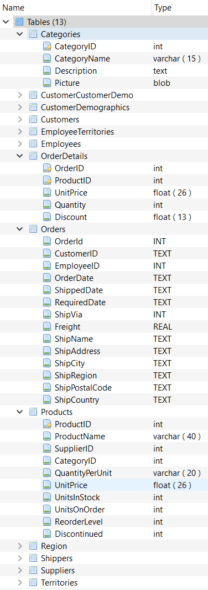

## Create Reports from Database

### Business Scenario
Management in a wholesaler of various food products wants some high level metrics about their organization. Extract and analyze data from a transactions database and prepare a set of visualizations.

### Questions to answer

1.	Number of products in stock per category
2.	Amount sold for the top 10 selling products
3.	Number 1 selling product & products sold less than $2000
4.	Total quantity of each product ordered in 2015
5.  Products sold in dollar amount by selling tier

### Database

### <a href=" https://github.com/ayumiohashi/udacity-data-analyst/blob/master/09-reports-from-database/reports.pdf">Reports</a>
<a href="https://github.com/ayumiohashi/udacity-data-analyst/blob/master/09-reports-from-database/sql-queries.txt">SQL queries</a> used to generate reports
